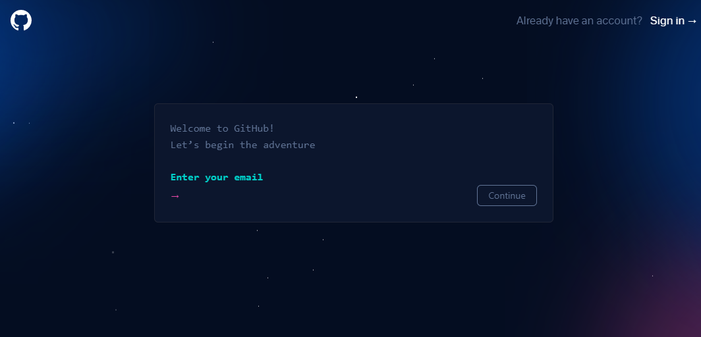
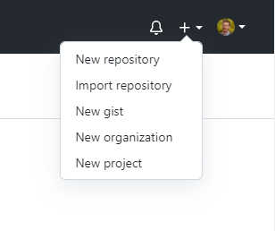
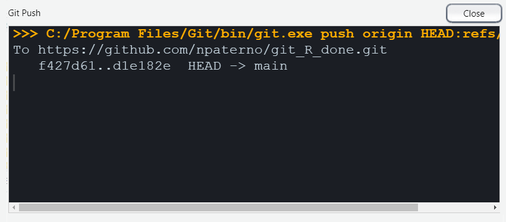

```{r setup, include=FALSE}
options(htmltools.dir.version = FALSE)
```

class: main

# Git R Done

### Downloading Git

```{r, echo = FALSE, out.width="80%", fig.align='center'}
knitr::include_graphics("images/00_git_install.PNG")
```

---

class: main

# Git R Done 

### GitHub::home

```{r, echo = FALSE, out.width="80%", fig.align='center'}
knitr::include_graphics("images/01_github_home.PNG")
```

---

class: main

# Git R Done 

### GitHub::signup

```{r, echo = FALSE, out.width="80%", fig.align='center'}

```

---

class: main

# Git R Done 

### Getting ready to sync

To sync RStudio and GitHub we'll need to install the `devtools` and `usethis` packages. Run the code below in your console pane in RStudio. 

```{r, eval = FALSE}
install.packages(c("devtools", "usethis"))
```

---

class: main

# Git R Done 

### Telling your machine your GitHub identity

This code will be run in either Terminal (Mac/Linux) or the Command Line (Windows)

```{r, eval = FALSE}
git config --global user.name "your_github_username"

git config --global user.email "email_for_github_login"

git config --list
```

The last of these will confirm the other commands ran correctly.

---

class: main

# Git R Done

### Giving RStudio access to your GitHub

Now we need to create a Personal Access Token (PAT) for RStudio to have access to your GitHub account. In your console pane:

```{r, eval = FALSE}
usethis::create_github_token()
```

--

```{r, echo = FALSE, out.width="70%", fig.align='center'}
knitr::include_graphics("images/03_github_PAT.PNG")
```

Copy the token!

---

class: main

# Git R Done

### Giving RStudio access to your GitHub

Back to the RStudio console:

```{r, eval = FALSE}
gitcreds::gitcreds_set()
```

Paste then token when prompted.

--

To confirm this worked:

```{reval = FALSE}
gh::gh_whoami()
```

---

class: main

# Git R Done

### Create a new repository

<div class="clearfix">
  <div class="img-container">
    
  </div>
</div>

---

class: main

# Git R Done

### Create a new repository

<div class="clearfix">
  <div class="img-container">
    
  </div>
  <div class="img-container">
    
  </div>
</div>
---

class: main

# Git R Done

### Creating an RStudio project

<div class="clearfix">
  <div class="img-container">
    
  </div>
</div>

---

class: main

# Git R Done

### Creating an RStudio project

<div class="clearfix">
  <div class="img-container">
    
  </div>
  <div class="img-container">
    
  </div>
</div>

---

class: main

# Git R Done

### Creating an RStudio project

<div class="clearfix">
  <div class="img-container">
    
  </div>
  <div class="img-container">
    
  </div>
  <div class="img-container">
    
  </div>
</div>

---

class: main

# Git R Done

```{r, echo = FALSE, out.width="70%", fig.align='center'}

```

---

class: main

# Git R Done

### Git commit

```{r, echo = FALSE, out.width="70%", fig.align='center'}

```

---

class: main

# Git R Done

### Git commit

```{r, echo = FALSE, out.width="70%", fig.align='center'}

```

---

class: main

# Git R Done

### Git commit

```{r, echo = FALSE, out.width="70%", fig.align='center'}

```

---

class: main

# Git R Done

### Git push

```{r, echo = FALSE, out.width="70%", fig.align='center'}

```